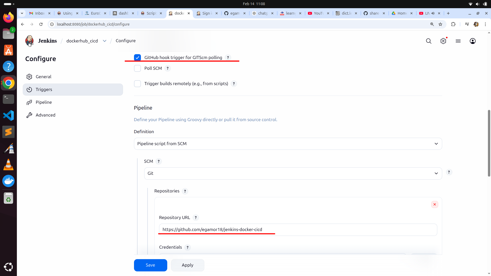
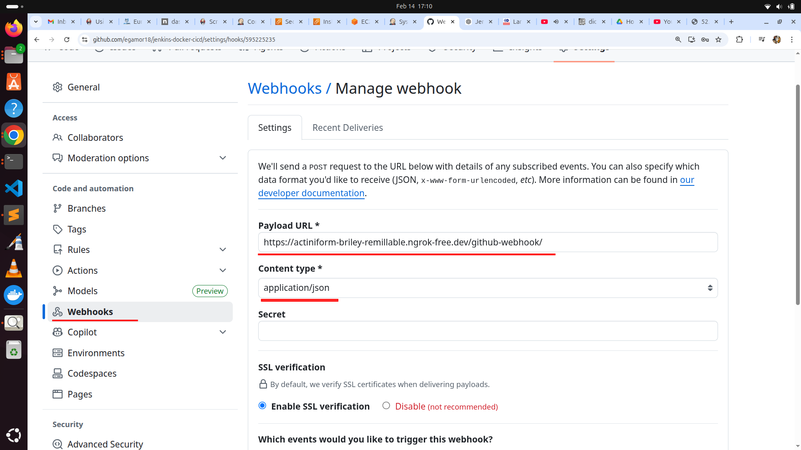
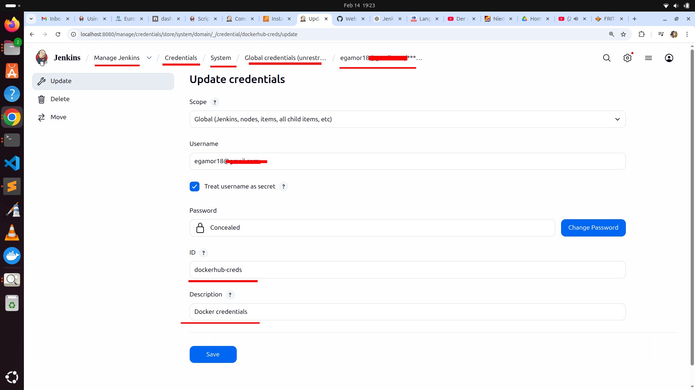
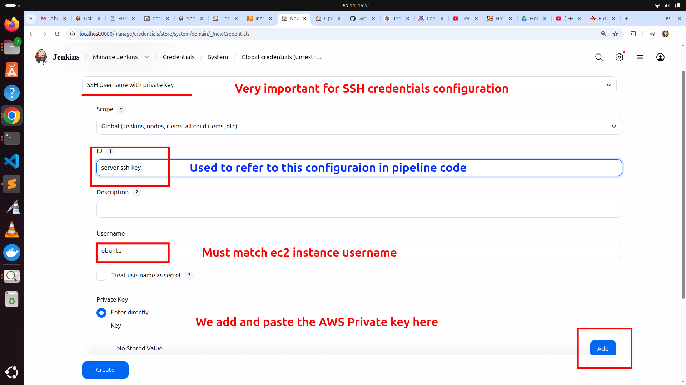

---

# **PROJECT: AUTOMATIC BUILDING, TESTING, AND DEPLOYMENT OF A MICROSERVICE-BASED APPLICATION USING JENKINS (CI/CD)**

---

# **What is Jenkins? — Use Case Explanation**

Jenkins is an **open-source automation server** used to implement **Continuous Integration (CI)** and **Continuous Delivery/Deployment (CD)** pipelines.

In practical terms, Jenkins automates:

* Building applications
* Running automated tests
* Packaging artifacts (e.g., Docker images)
* Deploying applications to target environments

In this project, Jenkins acts as the **central orchestration engine** that reacts to source code changes and executes a predefined pipeline to build, test, package, and deploy a **microservice-based Python application**.

---

# **High-Level Flow Summary**

```
Developer → GitHub → Jenkins → DockerHub → Deployment Target (Local / EC2)
```

**Image 1: Architectural overview**


---

## **Step-by-Step Workflow**

1. A developer pushes code to GitHub.
2. GitHub sends a **webhook event** to the Jenkins server.
3. Jenkins receives the event and detects a commit delta.
4. Jenkins checks out the latest version of the repository.
5. Jenkins executes the **Declarative Pipeline** defined in the `Jenkinsfile`.
6. The pipeline:

   * Prepares the Python test environment
   * Runs unit tests
   * Builds a Docker image
   * Pushes the image to DockerHub
   * Deploys the application

This setup follows a **microservice container-based deployment model**, where the application is packaged as an immutable Docker image.

---

# **Pipeline Configuration**

## **Jenkins Configuration Steps**

1. Installed Jenkins on a local Linux machine.
2. Installed required plugins:

   * Git
   * Pipeline
   * Docker Pipeline
   * Credentials Binding
   * SSH Agent
   * JUnit
3. Created a Jenkins Pipeline job.
4. Configured the job to:

   * Use GitHub as the source repository
   * Load the pipeline definition from the `Jenkinsfile`
5. Configured credentials for DockerHub and SSH.

**Image 2: Jenkins job configuration**


---

# **Webhook Configuration — Design Decision**

## **Problem Statement**

Jenkins was running **locally on my laptop within a private LAN**, while GitHub is a **public cloud service**.

**Key challenge:**

> How can GitHub send webhook events to a Jenkins instance that is not publicly accessible?

---

## **Initial Attempt: Router Port Forwarding**

I configured **port forwarding** on my home router to forward incoming traffic to the Jenkins host.

However:

* Jenkins remained unreachable from the internet.
* Investigation revealed that the ISP **blocks inbound traffic on all ports except 80 and 443**.

One option was to reconfigure Jenkins to run on port 80/443, but this was rejected to avoid conflicts with system services and security concerns.

---

## **Final Solution: ngrok Tunneling**

To overcome ISP restrictions, I used **ngrok**, which creates a secure public tunnel to a local service.

### **Steps Taken**

1. Registered on the ngrok platform.
2. Obtained an authentication token.
3. Installed ngrok on the local machine.
4. Started the tunnel:

```bash
ngrok http 8080
```

This generated a **public HTTPS URL** that forwarded traffic directly to Jenkins.

**Image 3: ngrok tunnel activation**


---

## **GitHub Webhook Configuration**

The ngrok URL was configured as the GitHub webhook endpoint:

* **Event type:** `push`
* **Payload URL:**

  ```
  https://<ngrok-id>.ngrok.io/github-webhook/
  ```

**Image 4: GitHub webhook configuration**


> ⚠️ Note: ngrok must be restarted after reboot, as the public URL changes.

---

# **Testing the Webhook Integration**

### **Test Procedure**

```bash
git add .
git commit -m "test webhook"
git push origin master
```

### **Observed Result**

1. GitHub received the push.
2. GitHub triggered the webhook event.
3. Jenkins received the event.
4. Jenkins automatically triggered the pipeline.

The event was visible in:

* Jenkins build history
* GitHub webhook delivery logs

**Image 5: Jenkins job triggered by webhook**


---

# **Declarative Pipeline Logic (Jenkinsfile)**

## **Pipeline Responsibilities**

### **1. Python Environment Preparation**

* Created a Python virtual environment
* Installed dependencies from `requirements.txt`

---

### **2. Application Testing**

* Executed unit tests using `pytest`
* Published results using JUnit reporting

---

### **3. Docker Image Build**

* Built the Docker image using the `Dockerfile`
* Tagged the image with the Jenkins build number

```bash
docker build -t egamor/jenkins-flask-app:${BUILD_NUMBER} .
```

---

### **4. Tagging and Pushing to DockerHub**

```bash
docker tag egamor/jenkins-flask-app:${BUILD_NUMBER} egamor/jenkins-flask-app:latest
docker push egamor/jenkins-flask-app:latest
```

---

## **DockerHub Authentication**

Pushing images to DockerHub requires authentication.

* Credentials stored securely in **Jenkins Credentials Manager**
* Injected using `withCredentials`
* Passwords masked in Jenkins logs
* Logs archived using `archiveArtifacts` for debugging

**Image 6: DockerHub credentials in Jenkins**


**Image 7: DockerHub login in pipeline script**


---

# **Deployment Strategy**

## **Local Deployment**

The application was first deployed locally for validation:

```bash
docker run -d -p 5000:5000 egamor/jenkins-flask-app:latest
```

Container status verified with:

```bash
docker ps
```

---

## **Remote Deployment on Amazon EC2**

A local Jenkins instance **cannot access EC2 without authentication**.
A secure trust mechanism is required.

---

## **SSH-Based Remote Deployment**

SSH authentication was used for EC2 deployment.

### **Steps**

1. Created an AWS EC2 SSH key pair.
2. Downloaded the private key.
3. Stored the private key securely in Jenkins Credentials as an SSH key.

**Image 8: SSH key configuration in Jenkins**


This allowed Jenkins to remotely execute commands on EC2 to:

* Pull the Docker image
* Stop and remove the old container
* Start a new container with the updated image

---

# **End-to-End Pipeline Test**

**Goal:** Full automation triggered by Git push.

1. Code change committed locally.
2. Code pushed to GitHub.
3. Webhook triggered Jenkins pipeline.
4. Jenkins built, tested, pushed, and deployed the application automatically.

---

# **Results and Discussion**

A webhook event triggered Jenkins (Image 9).

**Image 9: Webhook event receipt in Jenkins**


Jenkins executed all stages successfully and deployed the application to EC2.

Deployment was verified by:

* Jenkins pipeline logs
* `docker ps -a` on EC2
* Accessing the application via the EC2 public IP

**Image 10: Output of `docker ps -a`**


**Image 10: Application running on EC2**


---

# **Credential Storage Options in Jenkins**

* Username & Password
* Secret Text
* SSH Private Key
* AWS Credentials
* API Tokens

These methods control **secure credential injection and masking** in pipelines.

---

# **Skills Demonstrated**

* End-to-end CI/CD pipeline automation using Jenkins Declarative Pipelines
* GitHub webhook integration for event-driven builds
* Local CI tunneling using ngrok
* Secure credential handling in Jenkins
* Docker image lifecycle management
* Automated deployment to Amazon EC2 using SSH

---

# **Installed Jenkins Plugins**

* Git Plugin
* Pipeline Plugin
* Docker Pipeline Plugin
* Credentials Binding Plugin
* SSH Agent Plugin
* JUnit Plugin

---

## **Future Work**

* Replace SSH deployment with **AWS IAM Roles + SSM or EKS**
* Add **blue-green or rolling deployment**
* Implement **container health checks and rollback logic**

---

**Thank you for reading.**

**Eric Gamor**
AI / DevOps / Cloud Engineer

---
